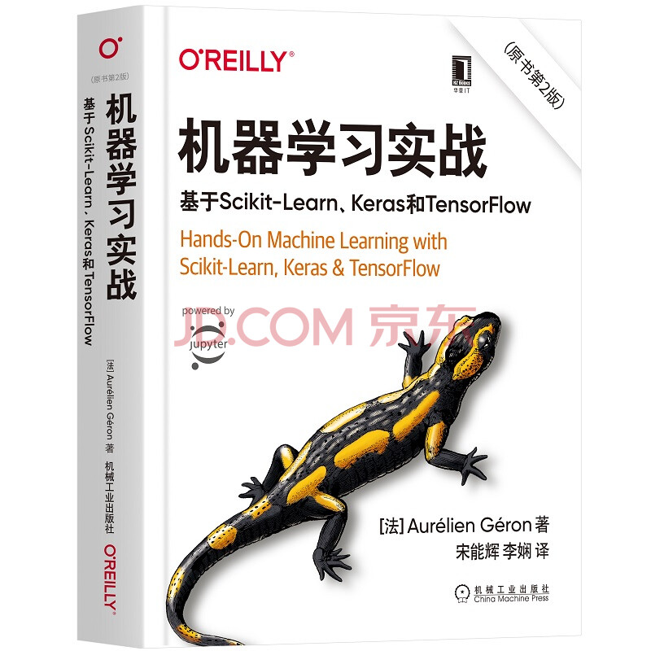
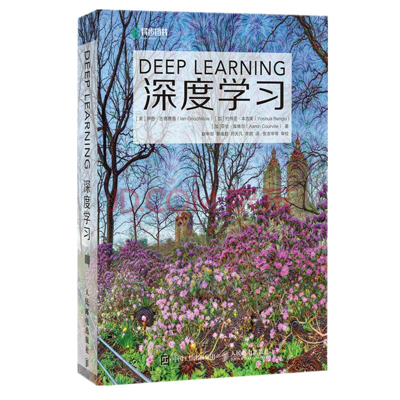
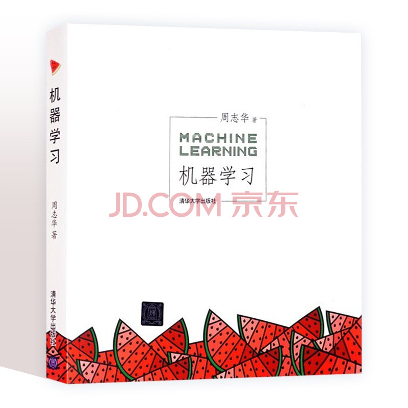

# 《机器学习实战》读书分享

* 英文书名：《Hands-On Machine Learning with Scikit-Learn,Keras & TensorFlow》
* 原书第二版
* [法] Aurelien Geron 著
* 宋能辉 李娴 译
* 原书代码Github地址： [https://github.com/ageron/handson-ml2](https://github.com/ageron/handson-ml2)
* 视频主页：[bilibili]()
* 代码地址：[Gitee](https://gitee.com/XuXiaoCong/learn-ai.git) / [Github](https://github.com/xuxiaocong/learn-ai.git)



## 信息

* 工具：VS Code
* Python3.8

## 使用

```shell
git clone https://gitee.com/XuXiaoCong/learn-ai.git
cd book-handson-ml2
pip install -r requirements.txt
```

## 简介

* 本书分为上下两部分
    * 机器学习: Scikit-Learn、Numpy、Matplotlib、Pandas
    * 深度学习: Keras、TensorFlow2.0


## 其他

* 大佬一般推荐的是[《深度学习》(花书)](https://github.com/exacity/deeplearningbook-chinese)，《机器学习》(西瓜书)
* 对新手入门过于困难，合适才是最好的




