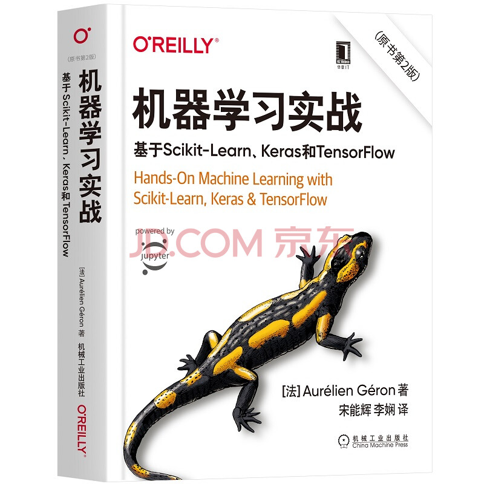

# 《机器学习实战》读书分享

* 英文书名：《Hands-On Machine Learning with Scikit-Learn,Keras & TensorFlow》
* 原书第二版
* [法] Aurelien Geron 著
* 宋能辉 李娴 译
* 原书代码Github地址： [https://github.com/ageron/handson-ml2](https://github.com/ageron/handson-ml2)
* 视频主页：[bilibili]()
* 代码地址：[Github]() / [Gitee](https://gitee.com/XuXiaoCong/learn-ai.git)

## 信息
* 编写时间：2022/03 ~ 至今
* 工具：VScode
* Python3.8
* 

## 使用

```shell
git clone https://gitee.com/XuXiaoCong/learn-ai.git
cd book-handson-ml2
pip install -r requirements.txt
```

